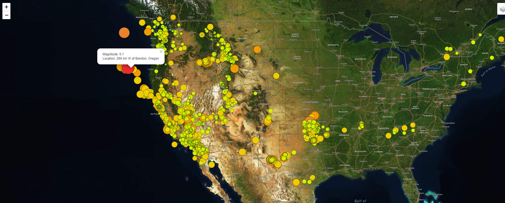

# Mapping_Earthquakes
Today's technology allows us to track events globally with more accuracy. As part of our analysis, we decided to take a look at the earthquake hotspots around the world. At first, we created a basic map and then overlayed it with earthquake data. The map is interactive and you can search out your places of interest. As you can see below our first map gives a broad picture from satellite view.

As you can see, you are able to move and scroll in to whatever part of the world or country that has data of your interest. Our map below focuses on the U.S mainland. Although you were able to see the western part of the country, we can use more of the tools to get a better look.

Below we see the use of one of the maps amazing tools. We are able to look at the magtitude of one of the earthquakes highlighted on a tectonic plate. (Greater activities in Red) As we look at the data we multiple places of activity with the details about that earthquake magnitude.

Although there may be much more activites on mainland U.S, we can agree that the larger magnitudes activities are much further south globally. 
Take a look at the picture below and the magnitude of the activities in comparison to the Unidted States

Now take a look at the global quantity of large activites shown on our tectonic plates. isn't that amazing !! Click the link below to go to our interactive site. 

http://127.0.0.1:5500/Mapping_Earthquakes/Earthquake_Challenge/index.html

